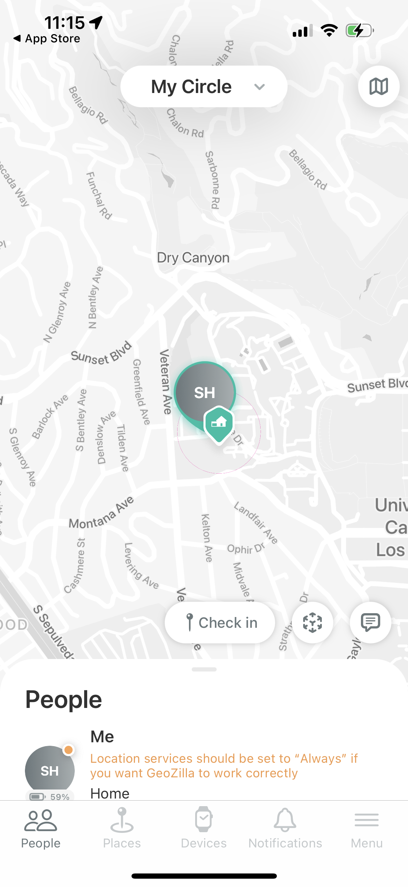
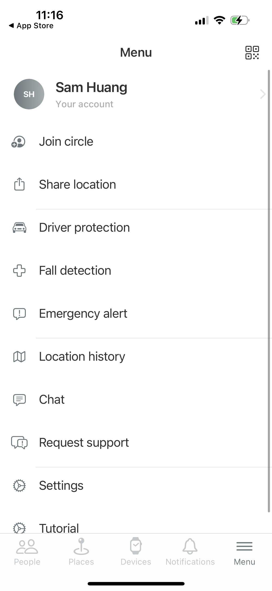

# Assignment 01: Heuristic Evaluation - Yongsen Huang

## Tentative Title: TribeTrack
As I left home for college, I found myself lacking communication with my family. I often wondered where they were and what they were doing, and most importantly, if they had made it home safely. To address this issue, I decided to create an app that would allow me to connect with my family more easily.

Knowing the location of your family members can provide a great sense of security and peace of mind. This is particularly important when family members are traveling or in unfamiliar places. With this app, family members can easily stay in touch and communicate with each other, no matter where they are located. Furthermore, the app could be developed with features that cater specifically to families. For instance, shared calendars, shopping lists or to-do lists could be incorporated into the app. These features would allow family members to collaborate with one another and stay organized. In addition, the app could have a feature that allows family members to share their daily activities with each other. This would help family members stay up to date with each other's lives and provide a way to bond even when they are apart. Another feature that could be added to the app is a family newsfeed. This could include updates from family members, photos, and important events. It would be a great way for family members to stay informed and connected with each other. Overall, the app has great potential to provide families with a convenient way to stay connected and organized, while also providing a sense of security and peace of mind.

## App #1: Life360
[Life360](https://www.life360.com) is a family safety app that provides real-time location tracking, communication, and safety features for families. The app was initially developed as a way for families to keep track of their loved ones' location, especially when they were out and about in the city. Today, Life360 has evolved into a comprehensive family safety platform with over 25 million active users in more than 140 countries. The app allows family members to share their location with each other, create private groups, set up geofenced areas, and receive alerts when family members enter or leave specific locations.

### Heuristics Evaluation:

| Heuristic & Description | Evaluation | Recommendation | Severity Rating |
| --------------- | --------------- | --------------- | --------------- |
| 1. Visibility of system status: Users must be able to monitor system status, including process completion and error notifications. | Strengths: The app provides clear and up-to-date information on the location and status of family members. Weaknesses: The app could improve by providing clearer indicators of when a family member's location is being updated or when communication is established. | Add more visual cues to indicate when the app is working and when updates are being made. This could include adding loading animations or progress bars when certain actions are taking place, or changing the color of certain elements to signify that they are currently active. | 2 |
| 2. Match between system and the real world: The system should use familiar language and concepts, and follow real-world conventions whenever possible. | Strengths: The app uses standard terminology and icons that are familiar to users, such as the map view and chat icons. Weaknesses: The app could improve by providing clearer labels and instructions for certain features, such as setting up geofenced areas. | Improve labeling and instructions for certain features to reduce confusion. For instance, users may be unclear about the purpose and function of certain buttons or links. For example, the keys and the building icon in the front page. | 1 |
| 3. User control and freedom: Users should be able to undo and redo actions and not feel trapped in the system. | Strengths: The app provides users with control over who they share their location with and when they receive notifications. Weaknesses: The app could improve by providing more options for customizing notifications and preferences. | Provide more options for customization of notifications and preferences. Release more free-to-use features since most of the assistance features require in-app-purchase. | 3 |
| 4. Consistency and standards: The system should have consistent design patterns across all interactions and pages. | Strengths: The app follows standard design conventions and layout. Weaknesses: The app could improve by providing more consistent layout and terminology across different platforms (i.e. iOS and Android). | Ensure consistency in layout and terminology across different platforms. | 1 |
| 5. Error prevention: The system should prevent and clearly communicate errors. | Strengths: The app provides clear feedback when there is an error, such as when a family member's location is not available. Weaknesses: The app could improve by providing more warnings or prompts when certain actions may result in errors, such as setting up incorrect geofenced areas. | It is advisable to include more warning messages or prompts when there is a likelihood of errors occurring. | 3 |
| 6. Recognition rather than recall: The system should be user-friendly and facilitate easy navigation. | Strengths: The app provides clear icons and labels for different features and functions. Weaknesses: The app could improve by providing more context and explanations for certain features and functions. | Provide more context and explanations for certain features and functions. | 1 |
| 7. Flexibility and efficiency of use: The system should be designed to suit users of varying experience levels, while also enabling experienced users to work more efficiently. | Strengths: The app provides quick and easy access to commonly used features, such as location tracking and communication. Weaknesses: The app could improve by providing more shortcuts or gestures for common actions. | Provide more shortcuts or gestures for common actions in the main page. | 1 |
| 8. Aesthetic and minimalist design: The system should have a clean and simple design, displaying only necessary information and features. | Strengths: The app has a clean and simple design that is easy to navigate. Weaknesses: The app could improve by providing more options for customizing the visual design. | Provide more options for customizing the visual design. | 1 |
| 9. Help users recognize, diagnose, and recover from errors: The system must provide clear error messages and guidance for error recovery. | Strengths: The app provides clear error messages and explanations for errors. Weaknesses: The app could improve by providing more suggestions or solutions for fixing errors. | Provide more suggestions or solutions for fixing errors. | 1 |
| 10. Help and documentation: The system must have concise documentation and easily accessible help for users. | Strengths: The app provides a help center and FAQs for users who need assistance. Weaknesses: The app could improve by providing more interactive or personalized support options, such as in-app chat or phone support. | Provide more interactive or personalized support options for users who need assistance. | 2 |

Overall, the Life360 app has a very good heuristic evaluation, with strengths in areas such as visibility of system status, match between system and the real world, user control and freedom, consistency and standards, and help and documentation. The app is well-designed, intuitive, and provides a range of useful features for families. However, there are some areas where the app could be improved, such as providing more customization options, more warnings or prompts for potential errors, and more interactive support options. Overall, the app provides a solid user experience and is a valuable tool for families looking to stay connected and safe.

## App #2: Geozilla
[GeoZilla](https://geozilla.com) is a location-based app that is designed to help families stay connected and safe. The app uses GPS tracking to provide real-time location updates for family members, allowing users to see where their loved ones are on a map and communicate with them easily. With features such as location sharing, geofencing, and alerts for when a family member arrives or leaves a location, GeoZilla helps families keep track of each other's whereabouts and ensure that everyone is safe and accounted for. The app is available on both iOS and Android devices and has gained popularity as a convenient and user-friendly tool for families looking to stay connected in today's fast-paced world.

### Heuristics Evaluation:

| Heuristic & Description | Evaluation | Recommendation | Severity Rating |
| --------------- | --------------- | --------------- | --------------- |
| 1. Visibility of system status: Users must be able to monitor system status, including process completion and error notifications. | Strength: The app provides clear and real-time location updates of family members on a map. Weakness: There could be more visual indicators to show when a family member is out of a safe zone or has low battery. | Provide more visual indicators or alerts to show when a family member is out of a safe zone or has low battery. This could include using different colors or icons for different statuses, or sending push notifications to alert users of important status changes. | 1 |
| 2. Match between system and the real world: The system should use familiar language and concepts, and follow real-world conventions whenever possible. | Strength: The app's interface and functionality are closely aligned with the real-world needs of families who want to keep track of each other's locations. Weakness: The app could benefit from more customization options to better match individual family needs. | Add more customization options to better match individual family needs. For example, allowing users to create their own custom safe zones or adjusting location sharing settings based on individual preferences. | 3 |
| 3. User control and freedom: Users should be able to undo and redo actions and not feel trapped in the system. | Strength: Users have a high level of control over location sharing and can easily turn off location tracking or leave groups. Weakness: The app could benefit from more granular control options for location sharing, such as limiting sharing to specific family members. | Provide more granular control options for location sharing, such as limiting sharing to specific family members. This could give users more control over who has access to their location information. | 3 |
| 4. Consistency and standards: The system should have consistent design patterns across all interactions and pages. | Strengths: The app follows standard design conventions and layout. Weaknesses: The app could improve by providing more consistent layout and terminology across different platforms (i.e. iOS and Android). | Ensure consistency in layout and terminology across different platforms. | 1 |
| 5. Error prevention: The system should prevent and clearly communicate errors. | Strength: The app provides clear warning messages when a user attempts to leave a group or stop sharing their location. Weakness: The app could benefit from more proactive error prevention, such as providing reminders to charge a device before location tracking stops. | Provide more proactive error prevention, such as reminders to charge a device before location tracking stops. This could help users avoid common errors that could impact their ability to use the app effectively. | 3 |
| 6. Recognition rather than recall: The system should be user-friendly and facilitate easy navigation. | Strength: The app uses clear icons and visual cues to help users easily recognize different functions and options. Weakness: The app could benefit from clearer labels or text descriptions for some features. | Add clearer labels or text descriptions for some features. This could help users better understand what different icons or symbols mean. | 1 |
| 7. Flexibility and efficiency of use: The system should be designed to suit users of varying experience levels, while also enabling experienced users to work more efficiently. | Strength: The app is easy to use and has a straightforward interface, making it efficient for regular use. Weakness: The app could benefit from more customization options to improve flexibility for different family needs. | Add more customization options to improve flexibility for different family needs. This could include allowing users to adjust the frequency of location updates or customize the map view. | 2 |
| 8. Aesthetic and minimalist design: The system should have a clean and simple design, displaying only necessary information and features. | Strength: The app has a clean and modern design that is easy on the eyes and straightforward to use. Weakness: The app could benefit from more color customization options to better suit individual preferences. | Add more color customization options to better suit individual preferences. This could help users personalize the app to better match their style and preferences. | 1 |
| 9. Help users recognize, diagnose, and recover from errors: The system must provide clear error messages and guidance for error recovery. | Strength: The app provides clear error messages and options for recovery, such as re-enabling location tracking. Weakness: The app could benefit from more proactive guidance to prevent errors, such as reminders to turn on location tracking if it has been turned off. | Provide more proactive guidance to prevent errors, such as pop-up messages to turn on location tracking if it has been turned off. This could help users avoid errors before they occur. | 3 |
| 10. Help and documentation: The system must have concise documentation and easily accessible help for users. | Strength: The app provides a range of helpful resources, such as FAQs and a support center. Weakness: The app could benefit from more interactive support options, such as video chatting or phone support, for users who need more personalized assistance. | Add more interactive support options, such as video chatting or phone support. This could provide users with more direct and immediate support when they encounter issues with the app. | 2 |

Overall, the heuristic evaluation of the Geozilla app identified both strengths and weaknesses across the 10 heuristics. Some of the strengths include the clear visibility of family member locations on a map, easy-to-use features for setting up safe zones, and the ability to communicate with family members through the app. However, some weaknesses were also identified, such as a lack of visual indicators for system status, inconsistent terminology used throughout the app, and limited customization options for some features. To improve the app, recommendations were made, such as adding more visual alerts for system status, providing more customization options, and adding more proactive error prevention and guidance. By addressing these weaknesses, the Geozilla app could provide a more user-friendly and efficient experience for families using the app to stay connected and safe.
