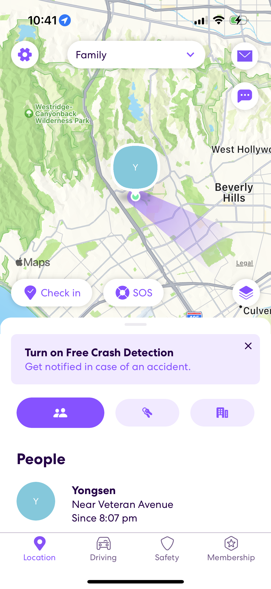
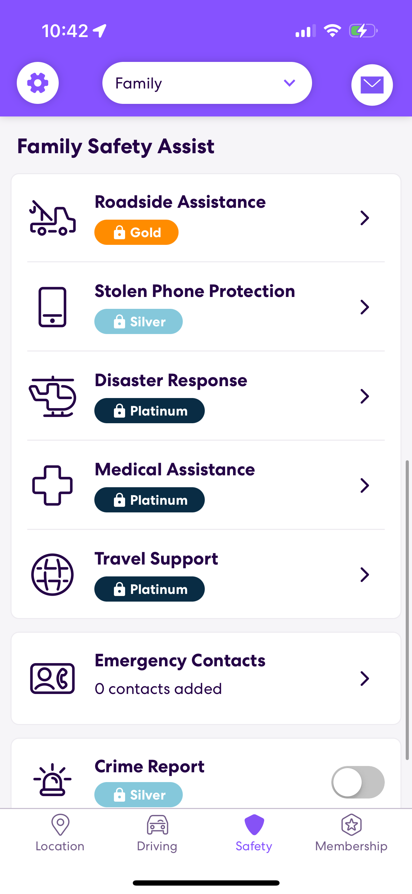
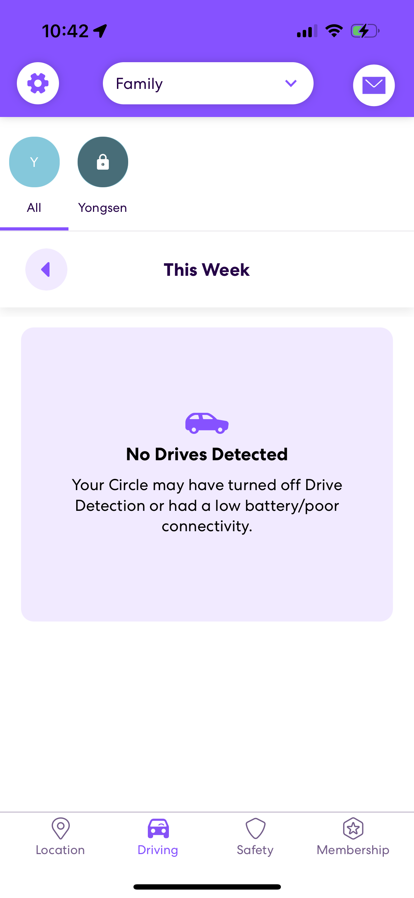

# Assignment 01: Heuristic Evaluation - Yongsen Huang, DH110 SPRING2023

## Tentative Title: TribeTrack
As I left home for college, I found myself lacking communication with my family. I often wondered where they were and what they were doing, and most importantly, if they had made it home safely. To address this issue, I decided to create an app that would allow me to connect with my family more easily.

Knowing the location of your family members can provide a great sense of security and peace of mind. This is particularly important when family members are traveling or in unfamiliar places. With this app, family members can easily stay in touch and communicate with each other, no matter where they are located. Furthermore, the app could be developed with features that cater specifically to families. For instance, shared calendars, shopping lists or to-do lists could be incorporated into the app. These features would allow family members to collaborate with one another and stay organized. In addition, the app could have a feature that allows family members to share their daily activities with each other. This would help family members stay up to date with each other's lives and provide a way to bond even when they are apart. Another feature that could be added to the app is a family newsfeed. This could include updates from family members, photos, and important events. It would be a great way for family members to stay informed and connected with each other. Overall, the app has great potential to provide families with a convenient way to stay connected and organized, while also providing a sense of security and peace of mind.

## App #1: Life360
[Life360](https://www.life360.com) is a family safety app that provides real-time location tracking, communication, and safety features for families. The app was initially developed as a way for families to keep track of their loved ones' location, especially when they were out and about in the city. Today, Life360 has evolved into a comprehensive family safety platform with over 25 million active users in more than 140 countries. The app allows family members to share their location with each other, create private groups, set up geofenced areas, and receive alerts when family members enter or leave specific locations.

### Heuristics Evaluation:

| Heuristic & Description | Evaluation | Recommendation |
| --------------- | --------------- | --------------- |
| 1. Visibility of system status | Strengths: The app provides clear and up-to-date information on the location and status of family members. Weaknesses: The app could improve by providing clearer indicators of when a family member's location is being updated or when communication is established. | Add more visual cues to indicate when the app is working and when updates are being made. |
| 2. Match between system and the real world | Row 2, Column 2 | Row 2, Column 3 |
| 3. User control and freedom | Row 2, Column 2 | Row 2, Column 3 |
| 4. Consistency and standards | Row 2, Column 2 | Row 2, Column 3 |
| 5. Error prevention | Row 2, Column 2 | Row 2, Column 3 |
| 6. Recognition rather than recall | Row 2, Column 2 | Row 2, Column 3 |
| 7. Flexibility and efficiency of use | Row 2, Column 2 | Row 2, Column 3 |
| 8. Aesthetic and minimalist design | Row 2, Column 2 | Row 2, Column 3 |
| 9. Help users recognize, diagnose, and recover from errors: | Row 2, Column 2 | Row 2, Column 3 |
| 10. Help and documentation | Row 2, Column 2 | Row 2, Column 3 |
